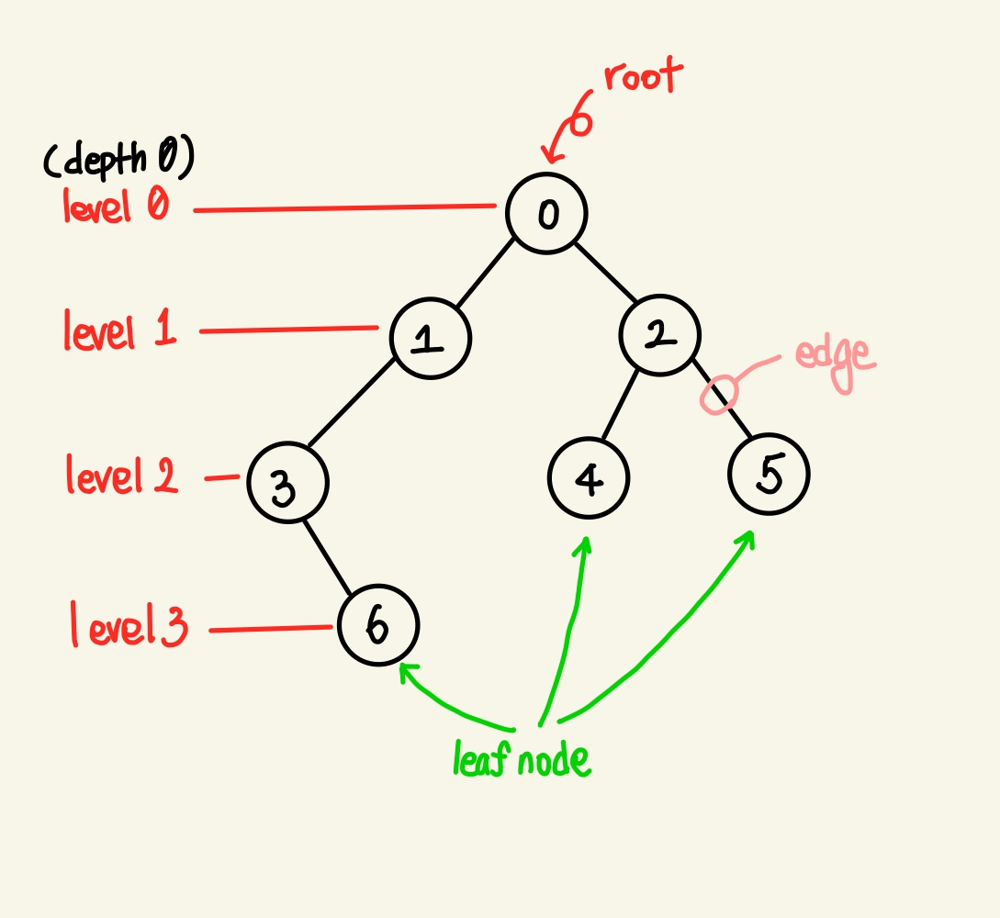
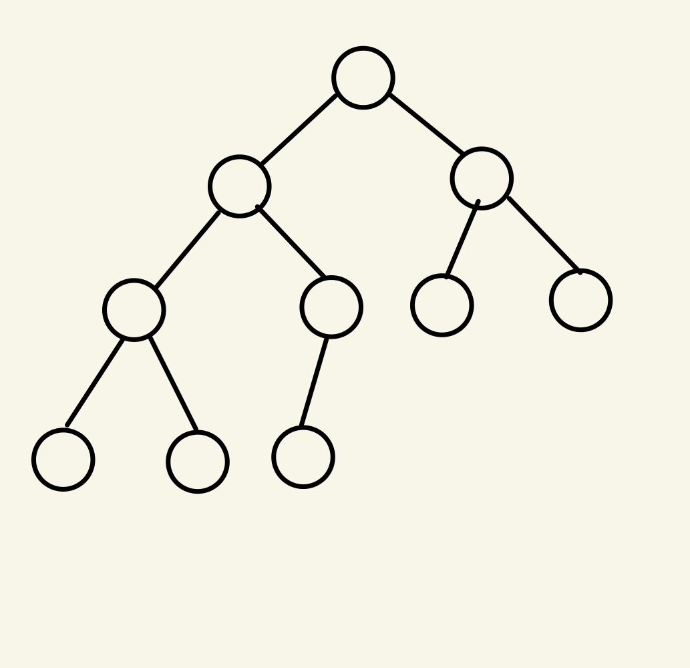
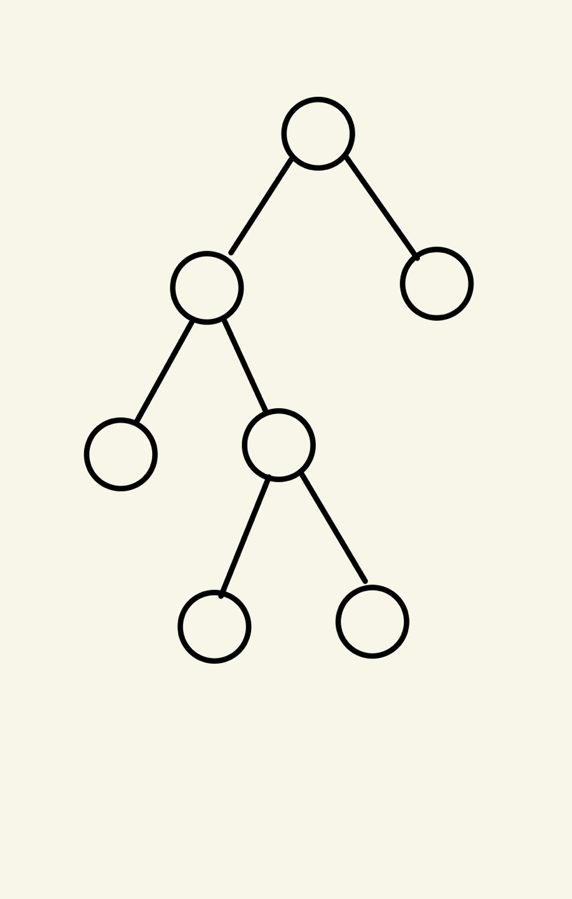
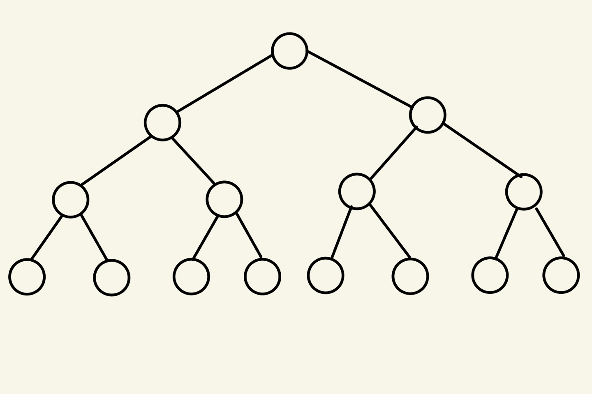
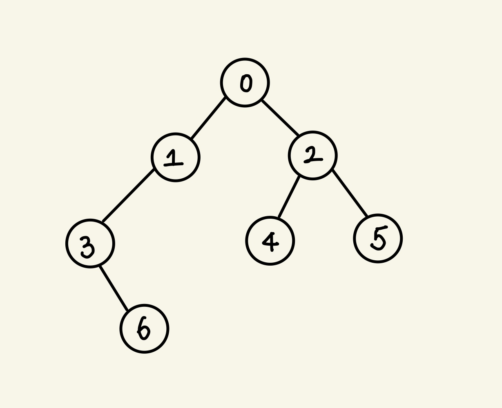

### Tree에 대해 얼마나 알고 있나요?

---
# Tree?

- 보편적으로 정의된 Tree는 그래프의 일종으로 다음과 같은 특징을 가지고 있습니다.

  - 여러 노드가 한 노드를 가르킬 수 없다.
  - 회로가 없다. (즉, 사이클이 발생하지 않는다.)
    - 즉, 트리는 DAG(Directed Acyclic Graphs)이다.
  - 노드와 노드를 잇는 길이 하나뿐이다. (직접 연결할 수 있는 간선을 말한다.)

- Tree로 구현할 수 있는 자료구조들은 꽤나 많이 있습니다. 제일 쉽고 많이 접해본 것들을 예로 들자면,

  - 이진 트리
  - 신장 트리 (MST)
  - 힙
  - 트라이

  가 있습니다. Tree 자료구조는 STL로 존재하지 않아서 필요시에는 직접 구현을 해야하지만, C++ 에서는 이진탐색(set)과 힙이 STL로 있고 Python에도 힙이 존재함을 알 수 있습니다. 구현된 자료구조를 그냥 사용하기 보다는 원리를 알고, 구현까지 해볼 수 있다면 더 단단한 기초지식을 가져갈 것이라 장담합니다 :)

- 그럼 오늘은 Tree에 들어가는 용어, ~~생성에 필요한 삽입/삭제~~(이거는 이진트리에서 알아보도록 할게오), 검색에 필요한 순회하는 방법에 대해 알아보도록 해보겠습니다. (C++과 Python 두 언어로 진행해보도록 할게요><) 

- 이진트리, 힙, 트라이는 다음 포스팅에서 찾아뵙도록 할겠습니다!

---

# Tree의 용어와 특징

## Tree의 용어

- 루트 노드(Root Node) : 부모가 없는 유일한 노드이고, 트리에는 하나의 루트 노드만을 가질 수 있다.

- 단말 노드(Leaf Node) : 자식이 없는 노드들이다.

- 내부 노드(Internal Node) : 단말 노드가 아닌 노드들이다.

- 간선(Edge) : 노드와 노드를 연결하는 선이다.

- 형제(Sibling) : 동일한 부모를 가지는 노드이다.

- 노드의 크기(Size) : 자신을 포함한 모든 자손 노드의 개수이다.

- 노드의 깊이(Depth) : 루트노드에서 어떤 노드까지 가는데 거쳐야 하는 간선(edge).

- 노드의 차수(Degree) : 자신에서 자식으로 가는 간선의 갯수이다.

- 트리의 차수(Degree of Tree) : 트리의 최대 차수(Degree)이다.

- 트리의 높이(Height) : 루트 노드에서 가장 멀리 있는 노드의 깊이이다.

  

  

## Tree의 특징

- 노드의 갯수가 N 개라면, 트리가 가지고 있는 간선(edge)의 갯수는 N-1 개이다.
- k 레벨에서는 2^k 개의 노드수를 가지고 있다.
- 정이진트리와 완전이진트리는 Class로 정의해서 만들 수도 있고, 배열을 통해서 만들 수 있다.
  - [1, 2, 3, 4] 일 때,
  - 왼쪽 자식 = 2 * 현재 인덱스 + 1
  - 오른쪽 자식 = 2 * 현재 인덱스 + 2
  - 즉, 1의 왼쪽 자식은 2 + 오른쪽 자식 3이고 2의 왼쪽 자식은 3 + 오른쪽 자식 4이다.

### 완전 ? 꽉찬? 포화?

- 이진트리에는 Complete Binary Tree, Full Binary Tree, Perfect Binary Tree 가 있다. 모두 다 트리이지만, 트리가 가진 모양과 특징에 따라서 달리 불린다. 가볍게 알고 넘어가는 것으로 하면 좋다!

  #### Complete Binary Tree

  

  - 마지막 레벨을 제외하고 트리의 모든 레벨에서 노드가 꽉 차 있는 이진 트리를 말한다. 그러나, 마지막 노드는 꽉 차지 않아도 좋지만 왼쪽부터 차근차근 채워져 있어야 한다.
  - 완전 이진 트리는 위에서 언급한 것 처럼 배열을 사용하여 효율적으로 표현이 가능하다.

  #### Full Binary Tree

  

  - 모든 노드가 자식이 없거나 2명의 자식만을 갖는 트리를 말한다. (이건 외우기 쉽죠?)

  #### Perfect Binary Tree

  

  - Complete + Full Binary Tree 라고 생각하면 된다.
  - 모든 단말 노드가 같은 레벨에 있어야 하고, 마지막 레벨의 노드 개수(리프노드의 개수)가 최대가 되어야 한다.
  - 노드의 갯수는 2^(트리의 높이 - 1) 로 정의를 할 수 있다.

---

# Tree의 생성와 순회

- 트리를 코드로 구현할 때는 트리의 root를 가르키는 무언가(C++ 은 포인터, python은 주소)를 설정해 놓는 것이 좋습니다. 대부분의 트리의 생성과 순회는 루트부터 시작하기 때문입니다. 일단 순회에 대해서 알아보고 코드를 보도록 합시다.

- Preorder : 루트 노드로부터 시작해서 노드 -> 왼쪽 서브트리 -> 오른쪽 서브트리 순으로 순회를 합니다.

- Inorder : 루트 노드로부터 시작해서 왼쪽 서브트리 -> 노드 -> 오른쪽 서브트리 순으로 순회를 합니다.

- Postorder : 루트 노드로부터 시작해서 왼쪽 서브트리 -> 오른쪽 서브트리 -> 노드 순으로 순회를 합니다.

  + Postorder는 후위연산자를 구현할 때 많이 쓰이며, 수학 공식을 우선순위에 맞게 풀때 도움이 됩니다.

- 게시된 코드는 아래의 트리 사진을 기반으로 Tree의 노드를 `vector<pair<int, int>> nodeInfoVec` 로부터 받아오면서 시작합니다.

  

  

- 코드를 참고해보자면 `class Node{}` 와 `class Tree{}` 로 나눠서 구현한 것을 알 수 있습니다. 각 클래스가 하는 기능들을 따져보자면

  - `class Node{}`
    - 노드의 정보를 가지고 있다. (노드번호, 왼쪽 자식, 오른쪽 자식 등등)
    - 데이터만 가지고 있기 때문에 C의 struct로 구현해도 무방하다.
    - 생성자를 통해 `leftChild`와 `rightChild` 에 대해 초기화를 해주지 않았지만, `NULL` 값 등으로 초기화를 해주는 것을 추천한다.
  - `class Tree{}`
    - 클래스 이름 그대로 트리라고 생각하면 된다. 노드처럼 각 데이터를 가지고 있기 보다는, 노드가 해야될 일(트리가 완성되기 위해)을 명시해 놓은 클래스라고 생각하면 된다.
    - `void insertNode(*,*,*)`는 노드를 연결하는 작업을 한다. 노드를 처음 삽입했을 경우 root를 설정해줘야 했기  때문에 if문이 필요한 것이다.
    - `void preOrder(*)`는 전위 순회를 나타낸 함수이다.
    - `void inOrder(*)`는 중위 순회를 나타낸 함수이다.
    - `void postOrder(*)`는 후위 순회를 나타낸 함수이다.
    - `int countChild(*)`는 각 노드가 가지고 있는 서브트리의 총 노드갯수를 세주는 것이다. (즉, 기준이 되는 노드가 가지고 있는 하위노드(자식)을 세는 것이다.)

---

# What about Python?

- 파이썬은 C++과 다르게 포인터 개념이 존재하지 않지만, 우리는 필요한 노드를 생성하여 똑같이 만들 수 있다. (코드가 더 짧은 것은 비밀)
- 위의 예시 사진을 기반으로 똑같이 트리를 만들어 보도록 해봅시다.
- 일다 코드를 보고 필요한 부분을 짚어볼까요? (~~사실 위에서 다 짚어서 없으ㄹ~~)

- pair를 쓰기 지친 당신에게 뜌쁠을 선물해드리겠습니다! 빠셍!
